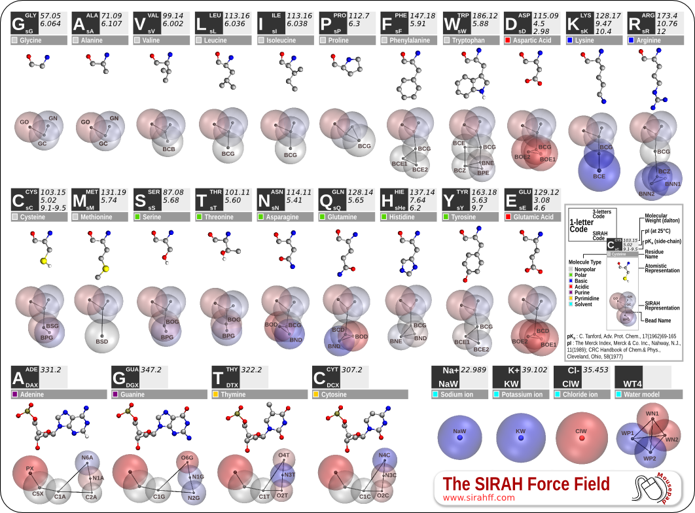
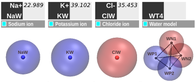
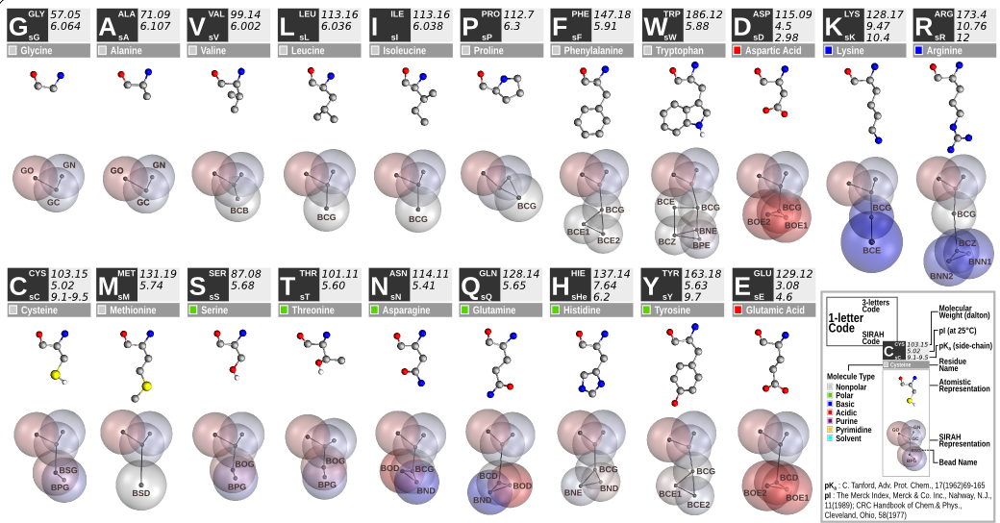
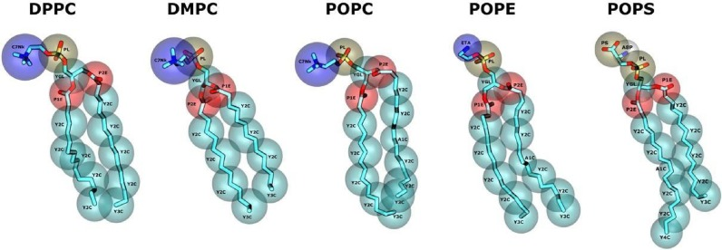
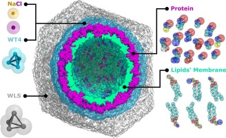

Background
==================

Coarse-Grained (CG) models are cost-effective approximations developed to lessen the computational cost associated with MD simulations. CG models consist of effective particles, referred to as beads, that represent groups of corresponding atoms. CG models can vary in resolution, ranging from supra-CG levels where a single bead represents an entire protein, to near-atomistic models that preserve most of the chemical characteristics (see a recent review on CG models [:ref:`1 <ref1>`]). 

As a CG force field, `SIRAH <http://www.sirahff.com/>`_ covers parameters and topologies for aqueous solvent, phospholipids, DNA, metal ions, and proteins. A recent update introduced modifications to bonded and non-bonded parameters, protonation states, post-translational modifications, and compatibility improvements for different force fields (see [:ref:`2 <ref2>`]). 

Overview
---------

In the SIRAH force field for CG simulations, the mapping from atomistic to CG representations entails strategically placing effective interactive beads at pivotal atoms involved in the structure or at atoms that form crucial intermolecular interactions (**Figure 1**). The distribution of these beads corresponds to intended interactions of functional groups based on size and charge, resulting in a heterogeneous distribution with higher bead density in regions that establish more diverse interactions.

   
   **Figure 1.** SIRAH force field CG representation.   
           
SIRAH employs a classical two-body Hamiltonian, facilitating its use in various MD engines without the need for extensive learning or format changes. In the following sections, we provide a synopsis of the CG models developed by SIRAH; however, for a more comprehensive material, please refer to our review paper on SIRAH development (see [:ref:`3 <ref3>`]).

DNA model
-----------------

.. figure:: ../images/mousepad-old-dna.png
   :align: center
   :width: 80%
   
   **Figure 2.** SIRAH force field DNA CG representation.   

The SIRAH's DNA model involves six effective beads representing each of the four CG nucleotides (**Figure 2**) (see [:ref:`4 <ref4>`] and [:ref:`5 <ref5>`] for more details). The mapping strategy considers the 5' - 3' prime polarity and electrostatic complementarity between A-T and G-C base pairs. The backbone is represented by two beads at the phosphate and C5' Carbon positions, while three beads on the Watson-Crick edge ensure base pair recognition. The five-membered sugar ring is depicted by a single bead situated at the C1' position, linking the backbone to the Watson-Crick edge.

Explicit solvent
---------------------

   
   **Figure 3.** SIRAH force field Solvent CG representation.   

In tandem with the DNA model development, a CG aqueous solvent was created, featuring CG water (WatFour or WT4) and monovalent electrolytic ions (sodium, potassium, chloride) (**Figure 3**) (see [:ref:`6 <ref6>`]). The WT4 model resembles a bulkier "water molecule". The monovalent ions are represented by single beads with a net charge of +/- 1e. Supra-CG solvent (WatElse or WLS) is also available (see [:ref:`7 <ref7>`])

Protein model
---------------------

   
   **Figure 4.** SIRAH force field amino acids CG representation.  

The CG protein model in SIRAH employs varying bead sizes to reflect different amino acid interactions. The latest version [:ref:`2 <ref2>`], refined in 2019, has significantly improved the ability to reproduce protein structures. The atomistic to CG mapping of protein side chains follows the DNA model philosophy, with effective beads placed at selected atoms along side chains, representing hydrophobic, aromatic, and polar interactions (**Figure 4**).

Phospholipids
------------------

   
   **Figure 5.** SIRAH force field phospholipids CG representation.

Following the completion of DNA, aqueous solvent, and protein models, the SIRAH force field aimed to incorporate a suitable CG lipid representation for simulating membrane proteins (**Figure 5**). Focusing on prototypical phospholipids, including phosphatidyl-choline (PC), -ethanolamine (PE), and –serine (PS) heads, along with myristoyl (M), palmitic (P), and oleic (O) acyl chains, SIRAH enabled simulations of diverse eukaryotic membrane components (see [:ref:`8 <ref8>`] for more details). 

Accurate representations of the SarcoEndoplasmic Reticulum Calcium (SERCA) pump's tilted orientation in a DMPC bilayer (see [:ref:`8 <ref8>`]), the electrostatics-driven opening of the Connexin 26 channels (see [:ref:`9 <ref9>`]), and the Zika Virus-Like Particle (see [:ref:`10 <ref10>`]) are some examples of SIRAH's phospholipids usage.

Divalent cations
---------------------

The SIRAH force field offers a set of interaction parameters for Calcium, Magnesium, and Zinc ions, covering over 80% of the metal-bound structures documented in the PDB. Simulations conducted on several proteins and DNA systems demonstrate the feasibility of these parameters (see [:ref:`11 <ref11>`]) .

Protein glycosylations
---------------------------------------

We have recently developed a CG representation that can accurately simulate a diverse range of polysaccharides and frequent glycosylation patterns found in proteins. The adaptability of the expanded collection of CG molecules offered by SIRAH is demonstrated by examples of its application to N-glycosylated proteins, such as antibody recognition and calcium-mediated glycan-protein interactions (see [:ref:`12 <ref12>`]).

Multiscale simulations
-----------------------

   
   **Figure 6.** SIRAH force field Virus-Like Particle CG representation.

The development of the SIRAH force field in a classical two-body Hamiltonian framework has facilitated multiscale simulations.

Available multiscale implementations in SIRAH:

- An all-atoms/CG model covalently linking both resolutions within a nucleic acid chain (see [:ref:`13 <ref13>`]); 

- A multiresolution solvent model allowing the mixture of fully atomistic solutes with a shell of atomistic solvent surrounded by CG water, applicable to highly solvated systems like viral capsids (see [:ref:`7 <ref7>`]).

- A triple solvation scheme, treating water at all-atoms, CG, and supraCG levels, is also available (see [:ref:`7 <ref7>`]). 

This is particularly useful for complex cellular systems and has been applied to assemble and simulate VLPs systems in an onion-shaped configuration using CG water (WT4) and supra-CG solvent (WLS) (**Figure 6**) (see [:ref:`7 <ref7>`] and [:ref:`10 <ref10>`]). 

References
-------------

.. _ref1:

[1] Borges-Araújo, L.; Patmanidis, I.; Singh, A. P.; Santos, L. H. S.; Sieradzan, A. K.; Vanni, S.; Czaplewski, C.; Pantano, S.; Wataru Shinoda, W.; Monticelli, L.; Liwo, A.; Marrink, S. J.; Souza, P. C. T. Pragmatic Coarse-Graining of Proteins: Models and Applications. Journal of Chemical Theory and Computation. 2023. |Review-2| |Review2-cit| 

.. |Review-2| image:: https://img.shields.io/badge/DOI-10.1021%2Facs.jctc.3c00733-blue?color=blue
   :alt: Access the paper
   :target: https://doi.org/10.1021/acs.jctc.3c00733
   
.. |Review2-cit| image:: https://img.shields.io/endpoint?url=https%3A%2F%2Fapi.juleskreuer.eu%2Fcitation-badge.php%3Fshield%26doi%3D10.1021%2Facs.jctc.3c00733
   :alt: Citation
   :target: https://scholar.google.com.uy/scholar?cites=14982031192725054357

.. _ref2:

[2] Machado, M. R.; Barrera, E. E.; Klein, F.; Soñora, M.; Silva, S.; Pantano, S. The SIRAH 2.0 Force Field: Altius, Fortius, Citius. Journal of Chemical Theory and Computation 2019, 15, 2719–2733. |SIRAH2.0|  |SIRAH2.0-cit|

.. |SIRAH2.0| image:: https://img.shields.io/badge/DOI-10.1021%2Facs.jctc.9b00006-blue
   :alt: Access the paper
   :target: https://doi.org/10.1021/acs.jctc.9b00006

.. |SIRAH2.0-cit| image:: https://img.shields.io/endpoint?url=https%3A%2F%2Fapi.juleskreuer.eu%2Fcitation-badge.php%3Fshield%26doi%3D10.1021%2Facs.jctc.9b00006
   :alt: Citation
   :target: https://scholar.google.com/scholar?oi=bibs&hl=es&cites=5136612330374064800

.. _ref3:

[3] Klein, F.; Soñora, M.; Santos, L. H.; Frigini, E. N.; Ballesteros-Casallas, A.; Machado, M. R.; Pantano, S. The SIRAH force field: a suite for simulations of complex biological systems at the coarse-grained and multiscale levels. Journal of Structural Biology 2023, 107985. |Review| |Review-cit|

.. |Review| image:: https://img.shields.io/badge/DOI-10.1016%2Fj.jsb.2023.107985-blue
   :alt: Access the paper
   :target: https://doi.org/10.1016/j.jsb.2023.107985
   
.. |Review-cit| image:: https://img.shields.io/endpoint?url=https%3A%2F%2Fapi.juleskreuer.eu%2Fcitation-badge.php%3Fshield%26doi%3D10.1016%2Fj.jsb.2023.107985
   :alt: Citation
   :target: https://scholar.google.com/scholar?cites=11014340861876399425

.. _ref4:

[4] Dans, P. D.; Zeida, A.; Machado, M. R.; Pantano, S. A Coarse Grained Model for Atomic-Detailed DNA Simulations with Explicit Electrostatics. Journal of Chemical Theory and Computation 2010, 6, 1711–1725. |DNA| |DNA-cit|

.. |DNA| image:: https://img.shields.io/badge/DOI-10.1021%2Fct900653p-blue
   :alt: Access the paper
   :target: https://doi.org/10.1021/ct900653p

.. |DNA-cit| image:: https://img.shields.io/endpoint?url=https%3A%2F%2Fapi.juleskreuer.eu%2Fcitation-badge.php%3Fshield%26doi%3D10.1021%2Fct900653p
   :alt: Citation
   :target: https://scholar.google.com/scholar?oi=bibs&hl=es&cites=12499613729973955498

.. _ref5:

[5] Zeida, A.; Machado, M. R.; Dans, P. D.; Pantano, S. Breathing, bubbling, and bending: DNA flexibility from multimicrosecond simulations. Physical Review E, 2012, 86. |DNA-2| |DNA-2-cit|   

.. |DNA-2| image:: https://img.shields.io/badge/DOI-10.1103%2FPhysRevE.86.021903-blue
   :alt: Access the paper
   :target: https://doi.org/10.1103/PhysRevE.86.021903
   
.. |DNA-2-cit| image:: https://img.shields.io/endpoint?url=https%3A%2F%2Fapi.juleskreuer.eu%2Fcitation-badge.php%3Fshield%26doi%3D10.1103%2FPhysRevE.86.021903
   :alt: Citation
   :target: https://scholar.google.com/scholar?cites=9768293008048576462
   

.. _ref6:

[6] Darré, L.; Machado, M. R.; Dans, P. D.; Herrera, F. E.; Pantano, S. Another Coarse Grain Model for Aqueous Solvation: WAT FOUR? Journal of Chemical Theory and Computation 2010, 6, 3793–3807. |Solvent| |Solvent-cit|

.. |Solvent| image:: https://img.shields.io/badge/DOI-10.1021%2Fct100379f-blue
   :alt: Access the paper
   :target: https://doi.org/10.1021/ct100379f

.. |Solvent-cit| image:: https://img.shields.io/endpoint?url=https%3A%2F%2Fapi.juleskreuer.eu%2Fcitation-badge.php%3Fshield%26doi%3D10.1021%2Fct100379f
   :alt: Citation
   :target: https://scholar.google.com/scholar?oi=bibs&hl=es&cites=11533073503238221292

.. _ref7:

.. |VLP1| image:: https://img.shields.io/badge/DOI-10.1021%2Facs.jctc.7b00659-blue
   :alt: Access the paper
   :target: https://doi.org/10.1021/acs.jctc.7b00659
      
.. |VLP1-cit| image:: https://img.shields.io/endpoint?url=https%3A%2F%2Fapi.juleskreuer.eu%2Fcitation-badge.php%3Fshield%26doi%3D10.1021%2Facs.jctc.7b00659
   :alt: Access the paper
   :target: https://scholar.google.com/scholar?cites=16637391138490147245

[7] Machado, M. R.; González, H. C.; Pantano, S. MD Simulations of Virus like Particles with Supra CG Solvation Affordable to Desktop Computers. Journal of Chemical Theory and Computation 2017, 13, 5106–5116. |VLP1| |VLP1-cit|

.. _ref8:

[8] Barrera, E. E.; Machado, M. R.; Pantano, S. Fat SIRAH: Coarse-Grained Phospholipids To Explore Membrane–Protein Dynamics. Journal of Chemical Theory and Computation 2019, 15, 5674–5688. |FatSirah| |FatSirah-cit|

.. |FatSirah| image:: https://img.shields.io/badge/DOI-10.1021%2Facs.jctc.9b00435-blue
   :alt: Access the paper
   :target: https://doi.org/10.1021/acs.jctc.9b00435
   
.. |FatSirah-cit| image:: https://img.shields.io/endpoint?url=https%3A%2F%2Fapi.juleskreuer.eu%2Fcitation-badge.php%3Fshield%26doi%3D10.1021%2Facs.jctc.9b00435
   :alt: Citation
   :target: https://scholar.google.com/scholar?oi=bibs&hl=es&cites=13191972720970339574

.. _ref9:

[9] Zonta, F.; Buratto, D.; Crispino, G.; Carrer, A.; Bruno, F.; Yang, G.; Mammano, F.; Pantano, S. Cues to Opening Mechanisms From in Silico Electric Field Excitation of Cx26 Hemichannel and in Vitro Mutagenesis Studies in HeLa Transfectans. Frontiers in Molecular Neuroscience 2018, 11, 170. |MemProt-1| |MemProt-cit|     
   
.. |MemProt-1| image:: https://img.shields.io/badge/DOI-10.3389%2Ffnmol.2018.00170-blue
   :alt: Access the paper
   :target: https://doi.org/10.3389/fnmol.2018.00170
   
.. |MemProt-cit| image:: https://img.shields.io/endpoint?url=https%3A%2F%2Fapi.juleskreuer.eu%2Fcitation-badge.php%3Fshield%26doi%3D10.3389%2Ffnmol.2018.00170
   :alt: Citation
   :target: https://scholar.google.com/scholar?cites=7027056542531206464&as_sdt=2005&sciodt=0,5&hl

.. _ref10:

[10] Soñora, M.; Martínez, L.; Pantano, S.; Machado, M. R. Wrapping Up Viruses at Multiscale Resolution: Optimizing PACKMOL and SIRAH Execution for Simulating the Zika Virus. Journal of Chemical Information and Modeling 2021, 61, 408–422. |VLP2| |VLP2-cit|     

.. |VLP2| image:: https://img.shields.io/badge/DOI-10.1021%2Facs.jcim.0c01205-blue
   :alt: Access the paper
   :target: https://doi.org/10.1021/acs.jcim.0c01205
      
.. |VLP2-cit| image:: https://img.shields.io/endpoint?url=https%3A%2F%2Fapi.juleskreuer.eu%2Fcitation-badge.php%3Fshield%26doi%3D10.1021%2Facs.jcim.0c01205
   :alt: Access the paper
   :target: https://scholar.google.com/scholar?cites=8645160591236740149

.. _ref11:

[11] Klein, F.; Cáceres, D.; Carrasco, M. A.; Tapia, J. C.; Caballero, J.; Alzate-Morales, J.; Pantano, S. Coarse-Grained Parameters for Divalent Cations within the SIRAH Force Field. Journal of Chemical Information and Modeling 2020, 60, 3935–3943. |Metal| |Metal-cit|   

.. |Metal| image:: https://img.shields.io/badge/DOI-10.1021%2Facs.jcim.0c00160-blue
   :alt: Access the paper
   :target: https://doi.org/10.1021/acs.jcim.0c00160
   
.. |Metal-cit| image:: https://img.shields.io/endpoint?url=https%3A%2F%2Fapi.juleskreuer.eu%2Fcitation-badge.php%3Fshield%26doi%3D10.1021%2Facs.jcim.0c00160
   :alt: Citation
   :target: https://scholar.google.com/scholar?oi=bibs&hl=es&cites=2583810250614166915

.. _ref12:

[12] Garay, P. G.; Machado, M. R.; Verli, H.; Pantano, S. SIRAH late harvest: coarse-grained models for protein glycosylation. Journal of Chemical Theory and Computation 2024. |GLY| |GLY-cit|

.. |GLY| image:: https://img.shields.io/badge/DOI-10.1021%2Facs.jctc.3c00783-blue
   :alt: Access the paper
   :target: https://pubs.acs.org/doi/10.1021/acs.jctc.3c00783

.. |GLY-cit| image:: https://img.shields.io/endpoint?url=https%3A%2F%2Fapi.juleskreuer.eu%2Fcitation-badge.php%3Fshield%26doi%3D10.1021%2Facs.jctc.3c00783
   :alt: Citation

.. _ref13:

[13] Machado, M. R.; Zeida, A.; Darré, L.; Pantano, S. From quantum to subcellular scales: multi-scale simulation approaches and the SIRAH force field. Interface Focus 2019, 9, 20180085. |MC2|  |MC2-cit| 

.. |MC2| image:: https://img.shields.io/badge/DOI-10.1098%2Frsfs.2018.0085-blue?label=DOI
   :alt: Access the paper
   :target: https://doi.org/10.1098/rsfs.2018.0085

.. |MC2-cit| image:: https://img.shields.io/endpoint?url=https%3A%2F%2Fapi.juleskreuer.eu%2Fcitation-badge.php%3Fshield%26doi%3D10.1098%2Frsfs.2018.0085
   :alt: Citation
   :target: https://scholar.google.com/scholar?cites=5473055142318037579

